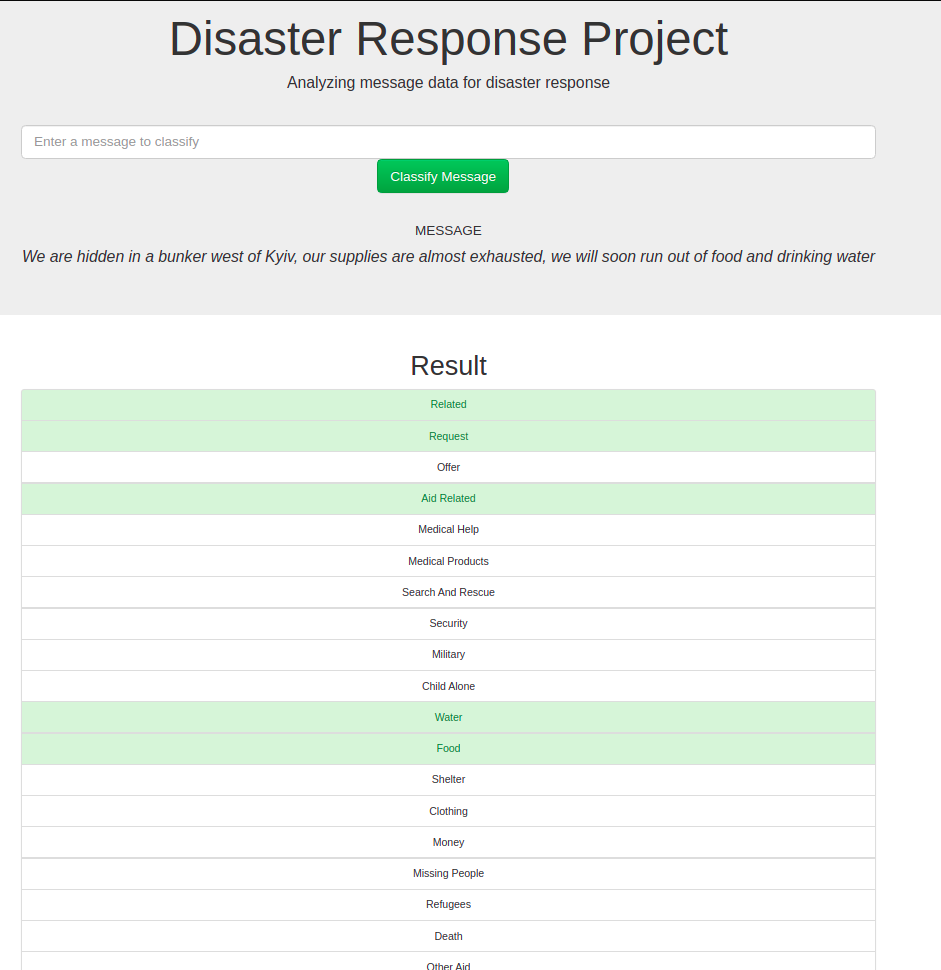
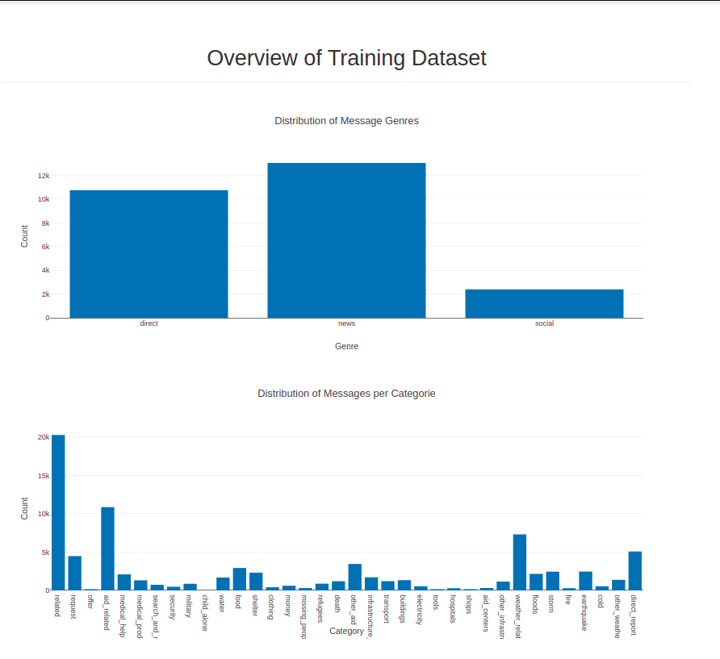

# Disaster-Response-Pipeline
This project is part of the Udacity Nanodegree Course: 
[Data Scientist](https://www.udacity.com/course/data-scientist-nanodegree--nd025) - Data Engineering

The Project analyzes disaster data from [Appen](https://appen.com/) containing real messages that 
were sent during disaster events and builds a model for an API that classifies disaster messages.

## Installation
You can install the repository on your pc by using:
```
git clone git@github.com:Ivana-DS/Disaster-Response-Pipeline.git
```
Python version: 3.8.10

You also need to install the requirements file:
```
pip install -r requirements.txt
```

## Project Components
**1. ETL Pipeline**
- Loads the messages and categories datasets
- Merges the two datasets
- Cleans the data
- Stores it in a SQLite database

**2. ML Pipeline** 
- Loads data from the SQLite database
- Splits the dataset into training and test sets
- Trains and tunes a model using GridSearchCV
- Outputs results on the test set
- Exports the final model as a pickle file

**3. Flask Web App**
- classifies new messages in several categories
- displays some visualizations of the data




## Project Structure
```
- app
| - template
| |- master.html  # main page of web app
| |- go.html  # classification result page of web app
|- run.py  # Flask file that runs app

- data
|- disaster_categories.csv  # data to process 
|- disaster_messages.csv  # data to process
|- process_data.py  # ETL Pipline
|- InsertDatabaseName.db  # database to save clean data to

- models
|- train_classifier.py # ML Pipline
|- classifier.pkl  # saved model 

- readme_images 
|- classification_example.png
|- data_visualisation_examlpe.png

- .gitignore
- README.md
- requirements.txt
```
## Usage
**1. ETL Pipeline**
To run the ETL Pipeline go to the data repository:

```
cd data
```
and run:

```
python process_data.py disaster_messages.csv disaster_categories.csv DisasterResponse.db
```
**2. ML Pipeline**

To run the ML Pipeline and train the model go to the models repository:

```
cd models
```
and run:

```
python train_classifier.py ../data/DisasterResponse.db disaster_messages classifier.pkl
```
This step takes about 1 hour and 40 minutes, because of the optimizing of the parameters with grid search.
If you just want to try the Flask Web App than feel free to use the given model: models/classifier.pkl

**3. Flask Web App**
To run the Fask Web App and classify messages go to the app repository:

```
cd models
```
and run:

```
python run.py
```
and then open http://127.0.0.1:3000 in your browser

